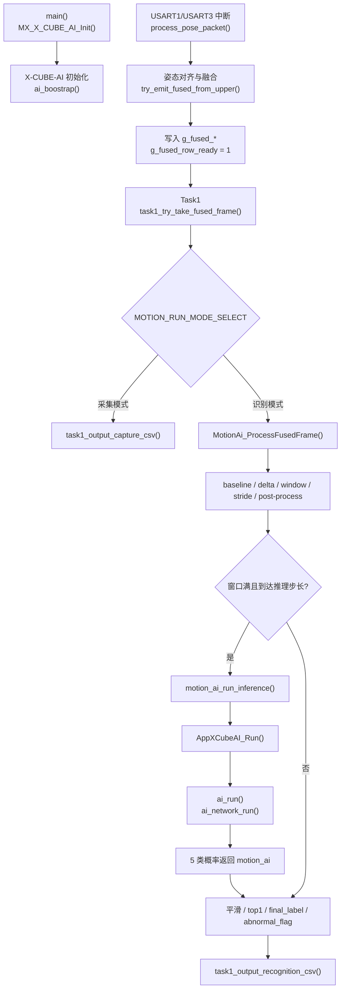

# STM32H743 动作识别工程 AI 部署代码梳理

## 1. 这份文档是干什么的

这份文档的目标是帮你快速掌握当前工程里 **AI 部署相关的整条代码链路**。

我会把下面几件事讲清楚：

- AI 在工程里是怎么初始化的
- 融合后的姿态数据是怎么进入 AI 业务模块的
- `motion_ai.c` 里到底做了哪些事情
- 模型推理是怎么被真正调用的
- 最终串口输出是从哪一层出来的
- 每个关键变量、关键函数各自负责什么

这份文档只围绕 **当前已经写好的代码** 展开，不讲“未来想法版”，只讲“现在板子里这套代码”。

---

## 2. 一句话先说清当前 AI 链路

当前工程的 AI 链路可以概括成一句话：

> 两路串口姿态数据先在 `stm32h7xx_it.c` 里完成解析与融合，融合结果写入全局 `g_fused_*`；`Task1` 取走这一帧后，根据模式进入采集分支或识别分支；识别分支把一帧融合姿态送进 `motion_ai.c`，在那里完成 baseline、delta、30x6 滑窗、步长触发、后处理，然后通过 `AppXCubeAI_Run()` 调一次 X-CUBE-AI，最后再由 `freertos.c` 把识别结果打印出来。

---

## 3. 全链路总图



---

## 4. 你应该按什么顺序读代码

如果你想最快掌握这套 AI 代码，推荐按下面顺序看：

1. `Core/Src/main.c`
2. `Core/Src/stm32h7xx_it.c`
3. `Core/Src/freertos.c`
4. `Core/Inc/motion_ai.h`
5. `Core/Src/motion_ai.c`
6. `X-CUBE-AI/App/app_x-cube-ai.h`
7. `X-CUBE-AI/App/app_x-cube-ai.c`
8. `X-CUBE-AI/App/network.h`

原因很简单：

- `main.c` 告诉你 AI 是什么时候初始化的
- `stm32h7xx_it.c` 告诉你融合帧是从哪里来的
- `freertos.c` 告诉你哪一个任务真正消费融合帧
- `motion_ai.c` 告诉你识别逻辑到底怎么走
- `app_x-cube-ai.c` 告诉你模型推理是怎么落到 X-CUBE-AI Runtime 上的

---

## 5. 关键文件各自负责什么

### `Core/Src/main.c`

这里只做系统初始化和模块启动。

AI 相关最关键的一句是：

```c
MX_X_CUBE_AI_Init();
```

它的意义是：

- 在 FreeRTOS 启动前，就把 X-CUBE-AI 网络实例创建并初始化好
- 后面 `Task1` 真正进入识别模式时，只需要“调用推理”，不需要再做模型初始化

当前 `main.c` **不直接做任何识别逻辑**。

---

### `Core/Src/stm32h7xx_it.c`

这里负责：

- 串口接收
- 数据包解析
- 两路姿态按时间对齐
- 生成一帧融合姿态
- 把融合结果写进全局变量

关键全局变量在这里定义：

```c
volatile uint8_t  g_fused_row_ready;
volatile uint64_t g_fused_ts_us;
volatile float    g_fused_upper_yaw;
volatile float    g_fused_upper_pitch;
volatile float    g_fused_upper_roll;
volatile float    g_fused_fore_yaw;
volatile float    g_fused_fore_pitch;
volatile float    g_fused_fore_roll;
volatile uint32_t g_fused_seq_u;
volatile uint32_t g_fused_seq_f;
volatile uint32_t g_fused_lost_u;
volatile uint32_t g_fused_lost_f;
volatile uint32_t g_align_fail_count;
```

其中最关键的是：

- `g_fused_row_ready`
  表示“有一帧新的融合数据已经准备好”
- `g_fused_ts_us`
  当前融合帧时间戳
- 六个姿态量
  上臂 3 轴 + 前臂 3 轴
- `g_align_fail_count`
  当前累计融合失败次数

真正把融合结果“推出去”的点，在 `try_emit_fused_from_upper()` 里：

```c
g_fused_ts_us = upper_frame.ts_us;
g_fused_upper_yaw = upper_frame.yaw;
...
g_fused_row_ready = 1U;
```

这意味着：

- 中断文件只负责把“融合好的结果”放到共享区
- 不在这里做 baseline、滑窗、推理、后处理

---

### `Core/Src/freertos.c`

这里的核心角色是 `Task1`。

`Task1` 的作用不是“算 AI”，而是：

1. 从 `g_fused_*` 里安全取走一帧
2. 判断当前模式
3. 分发到采集路径或识别路径
4. 打印对应串口输出

最关键的一段是：

```c
if (task1_try_take_fused_frame(&fused_frame))
{
  task1_process_fused_frame(&fused_frame);
}
```

这两步分别代表：

- `task1_try_take_fused_frame()`
  从共享全局变量里复制一帧融合数据，并清掉 `g_fused_row_ready`
- `task1_process_fused_frame()`
  根据模式决定后续行为

当前模式分流是：

```c
switch (MOTION_RUN_MODE_SELECT)
{
  case MOTION_RUN_MODE_CAPTURE:
    task1_output_capture_csv(frame);
    break;

  case MOTION_RUN_MODE_RECOGNITION:
    result = MotionAi_ProcessFusedFrame(frame);
    task1_output_recognition_csv(frame, result);
    break;
}
```

所以你可以把 `freertos.c` 理解成：

> AI 流水线的“调度层”和“串口输出层”。

---

### `Core/Inc/motion_ai.h` + `Core/Src/motion_ai.c`

这两个文件是 **当前 AI 业务逻辑的主角**。

这里已经承担了：

- `WAIT_START -> COLLECT_BASELINE -> FILL_WINDOW -> RUNNING` 状态机
- baseline 计算
- `raw -> delta`
- `30x6` 滑窗维护
- 每 5 帧触发一次推理
- 4 次概率平滑
- `top1_label`
- `top1_prob_avg`
- `motion_energy`
- `final_label`
- `abnormal_flag`
- `align_fail_total`
- `align_fail_delta`

也就是说：

> 现在真正的“识别业务层”已经集中在 `motion_ai.c`，而不是散在 `freertos.c` 或中断文件里。

---

### `X-CUBE-AI/App/app_x-cube-ai.h` + `X-CUBE-AI/App/app_x-cube-ai.c`

这两个文件现在只负责一件事：

> 把你准备好的 `30x6 float` 输入喂给 X-CUBE-AI，然后拿回 `5 float` 输出。

当前对外主接口是：

```c
int AppXCubeAI_Run(
  const float input[APP_X_CUBE_AI_INPUT_FLOATS],
  float output[APP_X_CUBE_AI_OUTPUT_CLASSES]);
```

其中：

- 输入本质上是连续的 `180` 个 `float`
- 输出是 `5` 个 `float`

它不负责：

- baseline
- 滑窗
- 步长触发
- 后处理

这些都已经上移到 `motion_ai.c`

---

## 6. 模型输入输出是什么

从 `X-CUBE-AI/App/network.h` 可以直接看到：

```c
#define AI_NETWORK_IN_1_HEIGHT      (30)
#define AI_NETWORK_IN_1_CHANNEL     (6)
#define AI_NETWORK_IN_1_SIZE        (180)

#define AI_NETWORK_OUT_1_CHANNEL    (5)
#define AI_NETWORK_OUT_1_SIZE       (5)
```

所以模型约定是：

- 输入：`30 x 6`
- 输出：`5 类概率`

当前 5 类顺序固定是：

1. `rest`
2. `elbow_flex`
3. `front_raise`
4. `side_raise`
5. `shoulder_raise`

---

## 7. 从上电到开始识别，代码实际怎么走

下面按时间顺序，把整个 AI 过程完整展开。

### 阶段 A：上电初始化

入口：`main()`

关键调用：

```c
MX_CRC_Init();
MX_X_CUBE_AI_Init();
osKernelInitialize();
MX_FREERTOS_Init();
osKernelStart();
```

其中 `MX_X_CUBE_AI_Init()` 会进入 `app_x-cube-ai.c`：

```c
void MX_X_CUBE_AI_Init(void)
{
  ai_boostrap(data_activations0);
}
```

`ai_boostrap()` 做的是：

- `ai_network_create_and_init()`
- 取输入 tensor 地址
- 取输出 tensor 地址
- 让 `data_ins[0]` 和 `data_outs[0]` 指向真正的模型输入输出内存

这一步做完后，模型已经准备好，但还 **没有推理**。

---

### 阶段 B：串口中断收包并融合

主入口在：

- `USART1_IRQHandler()`：上臂
- `USART3_IRQHandler()`：前臂

两边最终都会调用：

```c
process_pose_packet(...)
```

然后进一步推进到融合输出：

```c
try_emit_fused_from_upper()
```

当时间对齐满足条件时，它会把结果写入 `g_fused_*`，并且：

```c
g_fused_row_ready = 1U;
```

这表示：

> “有一帧新的融合数据可以被任务层消费了”

---

### 阶段 C：Task1 抢走这一帧融合数据

入口：`StartTask1()`

任务一开始会先：

```c
MotionAi_Init();
```

它的意义是：

- 初始化 AI 业务上下文
- 把状态设为 `WAIT_START`
- 清空 baseline、窗口、概率平滑、异常保持等缓存

随后循环里，先取融合帧：

```c
if (task1_try_take_fused_frame(&fused_frame))
{
  task1_process_fused_frame(&fused_frame);
}
```

`task1_try_take_fused_frame()` 实际做了两件事：

1. 把 `g_fused_*` 全部复制到一个局部 `motion_fused_frame_t`
2. 把 `g_fused_row_ready` 清零

也就是说：

> `Task1` 是当前融合帧的唯一主消费者。

---

### 阶段 D：按模式分流

入口：`task1_process_fused_frame()`

#### 1. 采集模式

走：

```c
task1_output_capture_csv(frame);
```

这里只打印原始融合 CSV，不做 AI。

#### 2. 识别模式

走：

```c
result = MotionAi_ProcessFusedFrame(frame);
task1_output_recognition_csv(frame, result);
```

也就是说：

- `motion_ai.c` 负责“算”
- `freertos.c` 负责“打印”

这个边界现在非常清晰。

---

## 8. `MotionAi_ProcessFusedFrame()` 里面到底干了什么

这是当前识别链路最核心的函数。

你可以把它理解成：

> 每来一帧融合姿态，就推进一次 AI 状态机。

它内部主流程可以概括成下面这个伪代码：

```c
MotionAi_ProcessFusedFrame(frame)
{
    update_align_fail(frame);
    frame_to_raw(frame, raw[6]);

    if (state == WAIT_START)
        state = COLLECT_BASELINE;

    if (state == COLLECT_BASELINE)
        collect baseline;
    else
        raw -> delta -> window -> maybe inference -> post process;

    return &result;
}
```

下面把每一步展开。

---

### 8.1 `WAIT_START`

当前设计是：

- 不额外加外部 start 接口
- 识别模式下收到第一帧数据，就自动开始 baseline

代码等价于：

```c
if (g_motion_ai.result.ai_state == MOTION_AI_STATE_WAIT_START)
{
  g_motion_ai.result.ai_state = MOTION_AI_STATE_COLLECT_BASELINE;
}
```

所以 `WAIT_START` 更像是一个“启动占位状态”。

---

### 8.2 `COLLECT_BASELINE`

这里先把一帧融合姿态转成 `raw[6]`：

```c
raw[0] = frame->upper_yaw;
raw[1] = frame->upper_pitch;
raw[2] = frame->upper_roll;
raw[3] = frame->fore_yaw;
raw[4] = frame->fore_pitch;
raw[5] = frame->fore_roll;
```

然后存进 baseline 缓存：

```c
baseline_cache[baseline_count][6]
baseline_sum[6]
```

当前 baseline 参数在 `motion_ai.h`：

```c
#define MOTION_AI_BASELINE_TARGET_FRAMES (12U)
#define MOTION_AI_BASELINE_MAX_FRAMES    (15U)
```

当前实际逻辑是：

- 收前 12 帧做 baseline
- 每帧累加到 `baseline_sum[6]`
- 到第 12 帧时算出：

```c
base_mean[i] = baseline_sum[i] / 12
```

然后状态切到：

```c
MOTION_AI_STATE_FILL_WINDOW
```

---

### 8.3 `raw -> delta`

baseline 完成后，每一帧都会做：

```c
delta[i] = raw[i] - base_mean[i];
```

结果保存在：

- `result.delta[6]`

它的作用是：

- 消掉初始静止姿态偏置
- 让后续窗口输入更接近“动作变化量”

---

### 8.4 `motion_energy`

每帧 delta 生成后，还会立刻算一个动作能量：

```c
motion_energy = (delta[0]^2 + ... + delta[5]^2) / 6
```

这个量的作用很重要：

- 静止时它应该接近 0
- 动作越明显，它通常越大
- 后面 `final_label` 判定时，先看它是不是“小于静止阈值”

当前阈值在 `motion_ai.h`：

```c
#define MOTION_AI_E_REST_TH (4.0f)
```

---

### 8.5 `FILL_WINDOW`

这里开始维护真正送给模型的输入窗口：

```c
float window[30][6];
```

当前设计不是环形缓冲，而是连续数组：

- 窗口没满：直接往后写
- 窗口满了：`memmove` 左移 29 帧，再把新一帧放最后

这样做的好处是：

- `window` 内存总是连续
- 可以直接送给 `AppXCubeAI_Run()`
- 不需要额外拼接临时输入 buffer

在 `FILL_WINDOW` 阶段：

- 先不停塞 delta 帧
- 一旦 `window_count == 30`
- 立刻触发第一次推理
- 然后把状态切到 `RUNNING`

---

### 8.6 `RUNNING`

进入 `RUNNING` 后，每帧仍然继续：

1. `raw -> delta`
2. 更新 `motion_energy`
3. 更新 `window`

但不是每帧都推理，而是按步长：

```c
#define MOTION_AI_INFER_STRIDE (5U)
```

也就是：

- 每来 5 帧新数据
- 调一次模型

---

### 8.7 真正触发模型推理：`motion_ai_run_inference()`

这是从业务层进入 X-CUBE-AI 的唯一入口。

核心调用是：

```c
AppXCubeAI_Run(&g_motion_ai.window[0][0], output);
```

这里的意义是：

- 取 `window[30][6]` 这块连续内存
- 作为 `180` 个连续 `float`
- 送进 X-CUBE-AI

如果推理成功：

- `output[5]` 拿到 5 类概率
- 保存到 `result.probs[5]`
- 再推进概率平滑和后处理

---

## 9. `AppXCubeAI_Run()` 里面到底做了什么

这个函数就是 AI Runtime 的适配层。

当前逻辑非常直接：

```c
memcpy(data_ins[0], input, AI_NETWORK_IN_1_SIZE_BYTES);
ai_run();
memcpy(output, data_outs[0], AI_NETWORK_OUT_1_SIZE_BYTES);
```

也就是说：

1. 把业务层准备好的输入窗口拷到模型输入 tensor
2. 调 `ai_run()`
3. 再从模型输出 tensor 把 5 个概率拷出来

其中 `ai_run()` 最终会调用：

```c
ai_network_run(network, ai_input, ai_output);
```

这就是 **X-CUBE-AI 真正执行模型** 的地方。

---

## 10. 概率平滑与最终输出怎么来的

### 10.1 最新 5 类概率

每次推理完，`result.probs[5]` 保存的是 **最近一次原始模型输出**。

对应关系是：

- `probs[0]` -> `rest`
- `probs[1]` -> `elbow_flex`
- `probs[2]` -> `front_raise`
- `probs[3]` -> `side_raise`
- `probs[4]` -> `shoulder_raise`

---

### 10.2 概率平滑

内部还维护了：

```c
prob_history[4][5]
prob_avg[5]
```

当前参数：

```c
#define MOTION_AI_SMOOTHING_WINDOW (4U)
```

逻辑是：

- 保存最近 4 次推理输出
- 对 5 个类别逐类求平均

然后从平滑后的 `prob_avg[5]` 里找到最大值：

- 对应类别 -> `top1_label`
- 对应概率 -> `top1_prob_avg`

---

### 10.3 `final_label`

当前规则在 `motion_ai.c` 里很清楚：

```c
if (motion_energy < MOTION_AI_E_REST_TH)
    final_label = REST;
else if (top1_prob_avg >= MOTION_AI_P_KNOWN_TH)
    final_label = top1_label;
else
    final_label = UNKNOWN;
```

对应参数：

```c
#define MOTION_AI_P_KNOWN_TH (0.70f)
#define MOTION_AI_E_REST_TH  (4.0f)
```

你可以理解成：

- 先看动作能量是不是低到像静止
- 不是静止，再看模型有没有足够把握
- 有把握就输出已知类别
- 没把握就输出 `unknown`

---

### 10.4 `abnormal_flag`

`abnormal_flag` 不是主分类，它是“旁路异常位”。

它来源于：

```c
align_fail_delta = current_align_fail_total - last_align_fail_total
```

如果本帧发现：

```c
align_fail_delta > 0
```

那就把异常保持计数拉高：

```c
abnormal_latch_remaining = MOTION_AI_ABNORMAL_LATCH_FRAMES
```

当前配置：

```c
#define MOTION_AI_ABNORMAL_LATCH_FRAMES (10U)
```

所以当前行为是：

- 一旦检测到新融合失败
- `abnormal_flag` 连续保持 10 帧
- 但不会停止识别
- 也不会重置 baseline
- 也不会清空窗口

这正符合你前面定的设计原则。

---

## 11. 串口最终看到的内容从哪里来

识别模式下，最终串口输出函数是：

```c
task1_output_recognition_csv(frame, result);
```

当前输出字段顺序固定是：

```text
ts_ms,
ai_state,
motion_energy,
top1_label,
top1_prob_avg,
final_label,
abnormal_flag,
align_fail_total,
align_fail_delta,
p_rest,
p_elbow_flex,
p_front_raise,
p_side_raise,
p_shoulder_raise
```

也就是说：

- 时间戳来自 `frame->ts_us`
- 状态、能量、标签、异常位来自 `motion_ai_result_t`
- 5 类概率来自 `result.probs[5]`

这里再次体现了分层关系：

- `motion_ai` 负责算结果
- `freertos` 负责决定怎么打印

---

## 12. 关键变量速查表

### 12.1 融合链路共享变量（来自中断层）

| 变量 | 所在层 | 作用 |
| --- | --- | --- |
| `g_fused_row_ready` | `stm32h7xx_it.c` | 是否有新融合帧可读 |
| `g_fused_ts_us` | `stm32h7xx_it.c` | 当前融合帧时间戳 |
| `g_fused_upper_*` | `stm32h7xx_it.c` | 上臂姿态 |
| `g_fused_fore_*` | `stm32h7xx_it.c` | 前臂姿态 |
| `g_fused_seq_u/g_fused_seq_f` | `stm32h7xx_it.c` | 融合帧对应的原始包序号 |
| `g_fused_lost_u/g_fused_lost_f` | `stm32h7xx_it.c` | 当前累计丢包数 |
| `g_align_fail_count` | `stm32h7xx_it.c` | 当前累计融合失败次数 |

### 12.2 `motion_ai_result_t`（对外结果）

| 字段 | 作用 |
| --- | --- |
| `ai_state` | 当前 AI 状态机阶段 |
| `base_mean[6]` | baseline 均值 |
| `delta[6]` | 当前帧去 baseline 后的变化量 |
| `probs[5]` | 最近一次模型原始 5 类概率 |
| `top1_label` | 平滑后最大概率类别 |
| `top1_prob_avg` | 平滑后最大概率 |
| `motion_energy` | 当前动作能量 |
| `final_label` | 系统最终输出标签 |
| `abnormal_flag` | 旁路异常提示位 |
| `align_fail_total` | 当前累计融合失败总数 |
| `align_fail_delta` | 相比上次输出新增的融合失败次数 |
| `baseline_count` | baseline 已累计帧数 |
| `window_count` | 当前窗口已填帧数 |

### 12.3 `motion_ai.c` 内部上下文

| 变量 | 作用 |
| --- | --- |
| `baseline_cache[15][6]` | baseline 原始缓存 |
| `baseline_sum[6]` | baseline 求均值累加器 |
| `window[30][6]` | 真正送给模型的输入窗口 |
| `prob_history[4][5]` | 最近 4 次推理结果 |
| `prob_avg[5]` | 平滑后的 5 类概率 |
| `frames_since_infer` | 距离上次推理过了多少帧 |
| `abnormal_latch_remaining` | 异常位剩余保持帧数 |
| `last_align_fail_total` | 上次输出时的累计融合失败值 |

### 12.4 X-CUBE-AI 适配层关键变量

| 变量 | 作用 |
| --- | --- |
| `network` | X-CUBE-AI 网络实例句柄 |
| `ai_input` | 输入 tensor 描述 |
| `ai_output` | 输出 tensor 描述 |
| `data_ins[0]` | 输入 buffer 地址 |
| `data_outs[0]` | 输出 buffer 地址 |
| `pool0` | activations 内存池 |

---

## 13. 用一个实际示例走完整个流程

下面用“识别模式下的一帧数据”举例。

假设当前已经：

- baseline 完成
- 状态在 `RUNNING`
- 窗口已经满了
- 这次刚好到了第 5 帧，需要推理

### 第 1 步：中断层生成新融合帧

中断层把这一帧写到：

```text
g_fused_ts_us = 12345678
g_fused_upper_yaw = 10.2
g_fused_upper_pitch = -3.1
...
g_align_fail_count = 4
g_fused_row_ready = 1
```

### 第 2 步：Task1 取走融合帧

`task1_try_take_fused_frame()` 把上面这些值拷进：

```c
motion_fused_frame_t fused_frame;
```

### 第 3 步：进入 `MotionAi_ProcessFusedFrame()`

先转成：

```c
raw[6] = {
  upper_yaw, upper_pitch, upper_roll,
  fore_yaw, fore_pitch, fore_roll
};
```

### 第 4 步：算 delta

```c
delta[i] = raw[i] - base_mean[i];
```

### 第 5 步：算 motion_energy

```c
motion_energy = sum(delta[i]^2) / 6
```

### 第 6 步：把 delta 塞进 `window[30][6]`

窗口满时：

- 整体左移
- 新帧写到最后一行

### 第 7 步：因为到了 stride=5，触发推理

```c
AppXCubeAI_Run(&window[0][0], output);
```

### 第 8 步：模型返回 5 类概率

假设得到：

```text
[0.02, 0.81, 0.05, 0.07, 0.05]
```

这意味着当前这次原始 top1 是：

- `elbow_flex`

### 第 9 步：做 4 次平滑

假设平滑后的最大概率还是：

```text
top1_label = elbow_flex
top1_prob_avg = 0.76
```

### 第 10 步：做最终判定

如果：

- `motion_energy >= 4.0`
- `top1_prob_avg >= 0.70`

那么：

```text
final_label = elbow_flex
```

如果这帧刚好 `align_fail_delta > 0`，那：

```text
abnormal_flag = 1
```

但 `final_label` 依旧正常更新，不会暂停。

### 第 11 步：`freertos.c` 打印结果

最后串口上一行类似：

```text
12345,RUNNING,8.5312,elbow_flex,0.7600,elbow_flex,0,4,0,0.0200,0.8100,0.0500,0.0700,0.0500
```

---

## 14. 当前模式开关也要一起理解

模式开关在：

```c
motion_mode.h
```

当前定义：

```c
#define MOTION_RUN_MODE_SELECT MOTION_RUN_MODE_CAPTURE
```

也就是说：

- 默认还是采集模式
- 如果你想走完整 AI 流程
- 要把它改成 `MOTION_RUN_MODE_RECOGNITION`

模式切换后，**中断融合链路完全不变**，变的只是 `Task1` 消费融合帧后的处理方式。

---

## 15. 如果你要继续读/改代码，最该去哪一层

### 想改模型输入输出适配

去：

- `app_x-cube-ai.h`
- `app_x-cube-ai.c`

### 想改 baseline / delta / 步长 / 后处理

去：

- `motion_ai.h`
- `motion_ai.c`

### 想改串口输出字段

去：

- `freertos.c`

### 想改融合策略

去：

- `stm32h7xx_it.c`

但这层现在最好别和 AI 业务混在一起。

---

## 16. 最后帮你做一个“脑中模型”

你可以把当前工程在脑子里分成 4 层：

### 第 1 层：数据输入与融合层

文件：

- `stm32h7xx_it.c`

职责：

- 从传感器收包
- 做时间对齐
- 生成一帧融合姿态

### 第 2 层：任务调度与输出层

文件：

- `freertos.c`

职责：

- 取融合帧
- 模式分流
- 打印 CSV / 调试输出

### 第 3 层：AI 业务层

文件：

- `motion_ai.c`

职责：

- baseline
- delta
- window
- stride
- smoothing
- final_label
- abnormal_flag

### 第 4 层：AI Runtime 适配层

文件：

- `app_x-cube-ai.c`

职责：

- 把业务层输入喂给 X-CUBE-AI
- 取回模型输出

如果你记住这四层，整个 AI 部署代码就不会乱。

---

## 17. 结论

当前工程里的 AI 代码已经形成了一条清晰链路：

1. `main.c` 初始化 AI Runtime
2. `stm32h7xx_it.c` 生产融合帧
3. `Task1` 独占消费融合帧
4. `motion_ai.c` 完成识别业务逻辑
5. `app_x-cube-ai.c` 执行一次模型推理
6. `freertos.c` 输出最终调试结果

所以如果你后面继续开发，最重要的原则就是：

> **中断层只负责“产生融合帧”，业务层只负责“处理融合帧”，AI 适配层只负责“跑模型”。**

这样你再往下看代码，就会非常清楚每一层该做什么、不该做什么。
