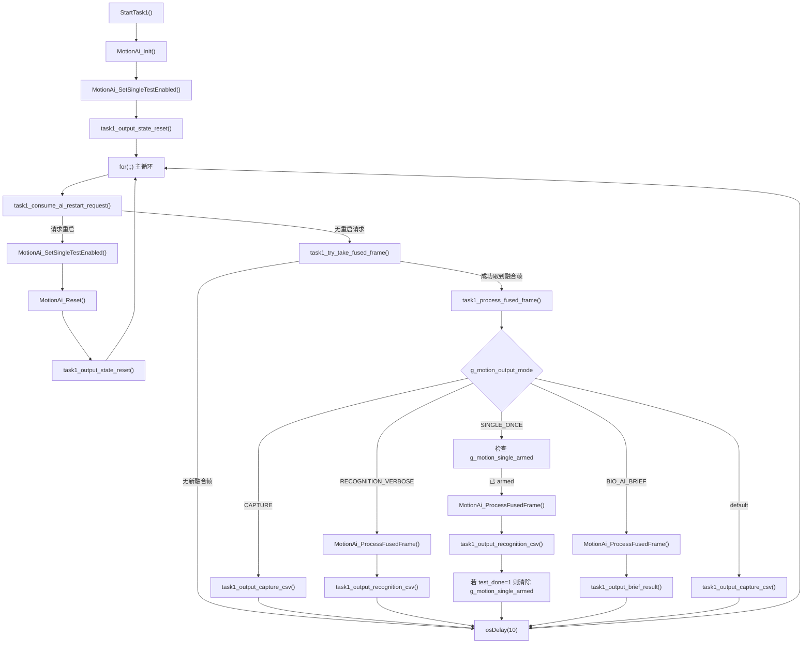

# Task1 流程说明

## 1. 任务定位

`Task1` 是当前工程里专门负责“消费融合后的动作/生理数据，并按模式执行 AI 推理或串口输出”的任务。

它不负责：

- 采集原始 IMU 数据
- 做 ESP8266 上云
- 管理 MQTT / OneNET 会话

它主要负责：

- 从全局融合结果区取一帧完整快照
- 根据当前输出模式决定是否执行 AI 推理
- 把结果按不同格式打印到串口
- 响应 AI 重启请求

对应入口函数在：

- `D:\Smart B\H7\Core\Src\freertos.c`
- 函数：`StartTask1()`

---

## 2. Task1 整体调用链



---

## 3. Task1 主循环是怎么跑的

`StartTask1()` 的代码骨架可以理解成下面这样：

```c
MotionAi_Init();
MotionAi_SetSingleTestEnabled(...);
task1_output_state_reset(...);

for (;;)
{
    if (task1_consume_ai_restart_request())
    {
        MotionAi_SetSingleTestEnabled(...);
        MotionAi_Reset();
        task1_output_state_reset(...);
        continue;
    }

    if (task1_try_take_fused_frame(&fused_frame))
    {
        task1_process_fused_frame(&fused_frame);
    }

    osDelay(10);
}
```

它每轮循环只做三件事：

1. 先看有没有 AI 重启请求
2. 再看有没有新的融合帧可以处理
3. 如果有，就按当前输出模式处理这一帧

最后固定 `osDelay(10)`，让出 CPU。

这说明 `Task1` 是一个“周期轮询型任务”，不是阻塞在队列或信号量上的事件驱动任务。

---

## 4. 入口函数：`StartTask1()`

### 作用

`StartTask1()` 是整个 Task1 的总控入口，负责：

- 初始化动作识别模块
- 设置当前是否启用“单次测试模式”
- 初始化输出状态
- 周期性拉取融合帧并处理

### 关键调用

#### `MotionAi_Init()`

作用：

- 初始化 AI 模块内部状态
- 为后续 `MotionAi_ProcessFusedFrame()` 做准备

#### `MotionAi_SetSingleTestEnabled()`

作用：

- 告诉 AI 当前是否运行在“单次测试”行为模式下

它的入参来自：

- `task1_mode_uses_single_test(g_motion_output_mode)`

#### `task1_output_state_reset()`

作用：

- 重置 Task1 的输出状态机
- 清理“表头是否打印过”“最终结果是否已经报过”等标志

---

## 5. `task1_consume_ai_restart_request()`

### 作用

这个函数专门处理“外部请求重启 AI”的情况。

它检查：

- `g_motion_ai_restart_req`

如果发现被置位，就在临界区里：

- 清除 `g_motion_ai_restart_req`
- 清除 `g_fused_row_ready`
- 返回 `1`

否则返回 `0`。

### 为什么要清 `g_fused_row_ready`

因为一旦 AI 会话准备重启，旧的融合帧就不应该继续送进新的 AI 流程，否则会把旧状态和新状态混在一起。

### 为什么要用临界区

这里用了：

- `taskENTER_CRITICAL()`
- `taskEXIT_CRITICAL()`

作用是保护共享全局标志，避免在检查和清零的过程中被别的上下文打断。

---

## 6. `task1_mode_uses_single_test()`

### 作用

这是一个很小的辅助函数，用来判断当前输出模式是否属于“单次测试模式”。

逻辑非常简单：

- 如果模式是 `MOTION_OUTPUT_MODE_SINGLE_ONCE`，返回 `1`
- 否则返回 `0`

### 它的用途

它主要被两个地方调用：

1. `StartTask1()` 初始化时
2. `task1_process_fused_frame()` 中，模式切换时

也就是说，它不是处理数据的，而是给 AI 模块提供模式配置。

---

## 7. `task1_output_state_reset()`

### 作用

这个函数重置的是 **Task1 的输出状态机**，不是 AI 内部状态机。

它管理的是：

- 上一次输出模式 `last_mode`
- capture 模式表头是否已打印
- recognition 模式表头是否已打印
- recognition 的最终结果是否已报过
- brief 模式上次推理计数
- brief 模式最终结果是否已报过

### 为什么要有这个函数

因为 `Task1` 是高频循环任务。如果不记录这些状态，会出现：

- 表头反复打印
- `TEST_DONE` 结果反复打印
- brief 模式重复刷相同结果

### `fresh_session` 参数的含义

- `fresh_session != 0`：表示开启一个新的 AI 会话，输出状态全部清零
- `fresh_session == 0`：表示模式切换但会话可延续，此时会从 `MotionAi_GetResult()` 中继承一部分已有状态

这使得模式切换时更平滑，不会每次都完全丢掉输出上下文。

---

## 8. `task1_try_take_fused_frame()`

### 作用

这个函数的职责是：

**把分散在多个全局变量中的“融合结果”，原子地拷贝到一个本地 `motion_fused_frame_t` 结构体中。**

它读取的数据包括：

- 时间戳 `g_fused_ts_us`
- 上臂 yaw/pitch/roll
- 前臂 yaw/pitch/roll
- 上下臂序列号
- 上下臂丢包统计
- 上下臂心率/血氧及有效标志
- 对齐失败计数

### 为什么这样设计

因为这些融合结果是别的执行上下文持续更新的。

如果 `Task1` 直接一项一项读取这些全局变量，就可能在读取过程中被更新，导致一帧数据前后不一致。

所以这里采用了：

1. 在临界区内一次性拷贝
2. 拷贝到本地 `frame`
3. 清掉 `g_fused_row_ready`

这可以把共享数据转成一份稳定快照。

### 返回值

- 返回 `1`：成功取到一帧
- 返回 `0`：当前没有新帧

---

## 9. `task1_process_fused_frame()`

### 作用

这是 Task1 的核心业务分发函数。

它负责两件事：

1. 处理“模式切换”带来的状态调整
2. 根据当前模式，把同一帧融合数据送往不同处理分支

### 第一步：检测模式切换

它会比较：

- `current_mode = g_motion_output_mode`
- `previous_mode = g_task1_output_state.last_mode`

如果模式发生变化，就：

1. `MotionAi_SetSingleTestEnabled(...)`
2. 检查“单次测试模式开关”是否发生变化
3. 如果变化了，就 `MotionAi_Reset()`
4. 然后调用 `task1_output_state_reset(...)`

### 为什么不是所有模式切换都 `MotionAi_Reset()`

因为当前逻辑只在“单次模式”和“非单次模式”之间切换时重置 AI。

也就是说：

- 从 `capture -> verbose`
- 或 `verbose -> brief`

这种切换不一定重置 AI 会话。

但如果是：

- `verbose -> single_once`
- `single_once -> capture`

因为单次测试行为发生了切换，所以要重置 AI。

### 第二步：按模式分发

#### `MOTION_OUTPUT_MODE_CAPTURE`

调用：

- `task1_output_capture_csv(frame)`

作用：

- 不做 AI 推理
- 直接输出融合后的姿态与 bio 数据

#### `MOTION_OUTPUT_MODE_RECOGNITION_VERBOSE`

调用链：

```text
MotionAi_ProcessFusedFrame(frame)
-> task1_output_recognition_csv(frame, result)
```

作用：

- 跑 AI 推理
- 输出完整识别状态、标签、概率、异常信息

#### `MOTION_OUTPUT_MODE_SINGLE_ONCE`

调用链：

```text
先判断 g_motion_single_armed
-> MotionAi_ProcessFusedFrame(frame)
-> task1_output_recognition_csv(frame, result)
-> 若 result->test_done != 0，则 g_motion_single_armed = 0
```

作用：

- 只有在“armed”状态下才处理数据
- 本次测试结束后自动撤防

#### `MOTION_OUTPUT_MODE_BIO_AI_BRIEF`

调用链：

```text
MotionAi_ProcessFusedFrame(frame)
-> task1_output_brief_result(frame, result)
```

作用：

- 跑 AI 推理
- 只输出简版结果，而不是全量 CSV

#### `default`

退回：

- `task1_output_capture_csv(frame)`

---

## 10. `task1_output_capture_csv()`

### 作用

这个函数只负责把融合帧按 CSV 打印出来。

内容包括：

- 时间戳
- 上下臂姿态
- 上下臂序列号
- 丢包统计
- 心率/血氧
- 对齐失败计数

### 它内部还调用了什么

它会先调用：

- `task1_bio_value_or_invalid()`

把无效的心率/血氧统一转成 `-999`。

### 为什么要有 `capture_header_printed`

因为表头只需要打印一次：

```text
ts_ms,upper_yaw,...
```

否则每 10ms 打印一次表头，串口会非常混乱。

---

## 11. `task1_output_recognition_csv()`

### 作用

这个函数负责输出 **详细识别结果**。

它会打印：

- `ai_state`
- `infer_count`
- `smooth_ready`
- `test_done`
- `motion_energy`
- `latest_label`
- `latest_prob`
- `top1_label`
- `top1_prob_avg`
- `final_label`
- `abnormal_flag`
- 对齐失败统计
- 各类别概率

### 它依赖哪些 AI 接口

输出文字标签时，它会调用：

- `MotionAi_StateName()`
- `MotionAi_LabelName()`

### `test_done` 在这里的意义

这个函数不仅打印每帧识别状态，还会在 `result->test_done != 0` 时补打一条总结行：

```text
TEST_DONE,stable_label=...,latest_label=...
```

### 为什么要有 `recognition_done_reported`

因为一旦 `test_done` 置位，后续很多帧里它仍可能保持为 1。

如果不做去重，就会重复打印很多次 `TEST_DONE`。

所以这个标志的作用是：

- 第一次完成时打印
- 后面同一次测试完成结果不再重复打印

---

## 12. `task1_output_brief_result()`

### 作用

这个函数是 `BIO + AI` 的精简输出版本。

它关注的是：

- 当前识别有没有推进到新的 `infer_count`
- 是否到达最终结果 `test_done`

### 何时打印

#### 情况 1：推理计数变化

打印：

```text
BRIEF,...
```

内容包含：

- 上下臂序列号
- 上下臂心率/血氧
- 当前 latest label

#### 情况 2：测试完成且最终结果未打印过

打印：

```text
BRIEF_FINAL,...
```

内容包含：

- 上下臂序列号
- 上下臂心率/血氧
- latest label
- final label

### 为什么要有 `brief_last_infer_count`

因为 brief 模式不是每帧都要输出，只想在“识别状态有推进”时才输出一条。

所以它用 `infer_count` 做去重。

---

## 13. `task1_bio_value_or_invalid()`

### 作用

这是一个很小的辅助函数，用来统一处理无效生理值：

- 如果 `valid == 0`，返回 `-999`
- 否则返回原始值

### 为什么有必要

因为这样上层输出函数就不需要每次自己判断心率/血氧是否有效，简化了打印逻辑。

---

## 14. Task1 依赖的关键全局变量

### 1. 融合帧输入相关

- `g_fused_row_ready`
- `g_fused_ts_us`
- `g_fused_upper_*`
- `g_fused_fore_*`
- `g_fused_seq_*`
- `g_fused_lost_*`
- `g_fused_upper_heart_rate`
- `g_fused_upper_spo2`
- `g_fused_fore_heart_rate`
- `g_fused_fore_spo2`
- `g_align_fail_count`

这些变量是 Task1 的数据源。

### 2. 模式控制相关

- `g_motion_output_mode`
- `g_motion_single_armed`
- `g_motion_ai_restart_req`

这些变量决定 Task1 当前以什么方式处理数据。

### 3. Task1 内部输出状态

- `g_task1_output_state`

它不代表 AI 状态，而代表：

- 当前输出模式历史
- 表头是否打过
- 结果是否已经输出过

---

## 15. Task1 运行流程总结

可以把 Task1 总结成下面这一条链：

```text
任务启动
-> 初始化 AI
-> 根据模式配置 AI 是否启用单次测试
-> 重置输出状态
-> 进入循环
   -> 看有没有 AI 重启请求
      -> 有则重置 AI 与输出状态
   -> 看有没有新的融合帧
      -> 没有则等待 10ms
      -> 有则拷一份融合快照
         -> 判断当前输出模式
            -> capture：直接打印融合 CSV
            -> verbose：跑 AI，打印详细识别 CSV
            -> single_once：armed 后跑一次 AI，结束自动撤防
            -> brief：跑 AI，打印简版识别结果
   -> 等待 10ms，进入下一轮
```

---

## 16. 一句话理解 Task1

`Task1` 本质上是一个“融合帧消费者 + AI 推理调度器 + 输出格式管理器”。

它的核心不是产生数据，而是：

- 从共享全局状态里安全取一帧
- 按模式决定是否跑 AI
- 把结果用合适的方式输出出来

